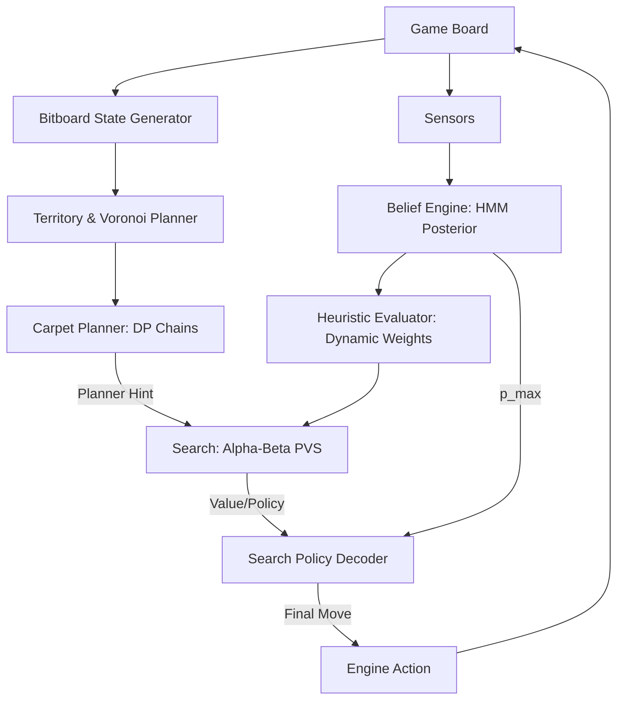

# Technical Specification & Design Philosophy: Yolanda Prime v6

## 1. Executive Summary: The Yolanda Prime v6
Yolanda Prime v6 (Architectural Codename: **"Bayesian Optimism"**) is a hybrid adversarial agent designed for competitive tile-based capture games. Its core design philosophy centers on **Asymmetric Resource Allocation**—dynamically pivoting between macroscopic territory expansion and microscopic adversarial hunting based on the entropy of the current game state.

The system employs a **Multi-Layered Architecture** that decouples probabilistic belief from deterministic search:
1.  **Tracking Layer**: A Hidden Markov Model (HMM) maintains a 64-cell posterior of hidden objective locations.
2.  **Strategic Layer**: A Voronoi-based territory engine and a "Carpet Planner" identify high-yield macroscopic targets.
3.  **Tactical Layer**: A Bitboard-optimized Alpha-Beta searcher (PVS) performs deep tactical verification of localized moves.
4.  **Policy Layer**: A deficit-aware margin controller decides when to commit "Search" actions versus "Move" actions, mitigating "death spiral" regressions observed in earlier iterations.

---

## 2. System Architecture & Information Flow

### Technical System Map

### Input-to-Output Data Graph
The transformation pipeline converts raw environment data into high-precision actions:
1.  **Raw Input**: `Board` (Cells, Workers, Scores) and `SensorData` (Noise, Distance).
2.  **Belief Transformation**: Updates 64-bin float64 vector. $B_{t+1} = \text{Normalize}(B_t \cdot T \cdot P(\text{Sensor}))$.
3.  **State Encoding**: Board compressed into three 64-bit integers (`space`, `carpet`, `primed`).
4.  **Heuristic Mapping**: Combines `territory_delta`, `chain_potential`, and `forecast_bonus` into a single scalar leaf score.
5.  **Search Output**: Returns `(best_move, score, depth, nodes, top2_gap)`.
6.  **Action Selection**: Final logic gate compares `ev_search` vs. `ev_move + margin(score_delta)`.

---

## 3. The Brain: HMM Belief Engine
The belief engine tracks the hidden rat position using a recursive Bayesian filter across all 64 cells.

### Technical Implementation
-   **Sensor Fusion**: Integrates Manhatten distance likelihoods and cell-type noise probabilities ($\text{NOISE\_PROBS}$).
-   **Bayesian Smoothing**: Implements a **0.5% uniform floor** ($0.005 / 64$) during normalization to prevent the model from becoming irreversibly overconfident in erroneous states.
-   **Information Decay**: If a search fails, the specific cell's probability is zeroed, and the vector is re-normalized.
-   **Forecast Data**: Projects the posterior 3 turns into the future ($B_{t+3} = B_t \cdot T^6$) to reward worker proximity to projected hotspots.

**Key Constant**:
- `Bayesian Smoothing Floor`: `0.005` (0.5% weight given to uniform prior).
- `Entropy Gate`: `0.75` (Activates information foraging when normalized Shannon entropy $H_{norm} > 0.75$).

---

## 4. The Processor: Alpha-Beta Bitboard Search
The primary search mechanism is a high-performance **Alpha-Beta searcher with Principal Variation Search (PVS)**.

### Optimizations
-   **Bitboards**: Full state representation in three `uint64` integers; move generation and application use bitwise shifts and masks ($O(1)$ operations).
-   **Transposition Table (TT)**: 80,000-entry capacity with generation-based aging and depth-first replacement.
-   **Null-Move Pruning (NMP)**: $R=2$ reduction. Crucially, **NMP is disabled when turns left $\le 10$** to prevent tactical blindness in the endgame.
-   **Late Move Reductions (LMR)**: Applies to non-carpet/non-PV moves at depth $\ge 3$. Carpet moves are considered "captures" and are never reduced.
-   **Aspiration Windows**: Initial window of $\pm 50.0$ points to prune the root search space.

### Performance Targets
-   **Depth Reached**: 8–18 in mid-game; 24 in endgame.
-   **Nodes Per Second**: ~800k to 1.2M (environment dependent).
-   **TT Flagging**: EXACT, LOWER_BOUND, UPPER_BOUND for PV stabilization.

---

## 5. The Dynamic Heuristic Engine (Phase Separation)

Strategic behavior is governed by a 7-term evaluation function with weights that adapt to game phases.

### Strategic Phase Breakdown
| Phase | Turns | Tactical Focus | Heuristic Bias |
| :--- | :--- | :--- | :--- |
| **Opening** | 0-19 | Territory Expansion | High $\beta$ (Territory), High Time Allocation (1.6x) |
| **Mid** | 20-59 | Consolidation/Search | Balanced $\alpha/\gamma$, Adaptive $\omega_{threat}$ |
| **Late** | 60+ | Point Maximization | High $\alpha$ (Score), Low Time Allocation (1.0x) |

### Core Heuristics
| Weight | Name | Description |
| :--- | :--- | :--- |
| `alpha` | Score Delta | Direct point difference ($us - opp$). |
| `beta` | Territory Voronoi | Control of space reachable faster than opponent. |
| `gamma` | Chain Potential | Max carpet yield available from primed cells. |
| `eta` | Forecast Bonus | Proximity to future rat HMM hotspots. |
| `omega` | Threat Penalty | Penalty if opponent has un-countered carpet threats $\ge 6$. |

---

## 6. Adversarial Modeling: The Shadow Component
The agent "fingerprints" the opponent by analyzing their last 4+ moves using the `infer_opponent_category` engine.

### Exploitation Filters
-   **The George Filter**: If the opponent performs $>35\%$ `PLAIN` moves (suggesting no search or carpet logic), the agent sets `lambda_denial = 0.05` and increases `alpha` by $1.3\times$. This prevents wasting search tempo against suboptimal bots.
-   **Carpet Specialist Detection**: If the opponent is high-yield carpet-heavy, the agent boosts `omega_threat` ($1.5\times$) and `beta` ($1.2\times$) to prioritize defensive denial.
-   **Search Specialist Detection**: Against search-heavy bots, the agent increases `alpha` aggression to out-score their search hits.

---

## 7. The Tactician: Carpet Planner
The Macroscopic engine uses a **Greedy DP-based Carpet Planner** to provide search hints.

-   **Mechanism**: Enumerates all straight-ray and single-pivot "Elbow" builds from every worker-reachable cell within 4 steps.
-   **Scoring**: Uses "Points-per-Tempo" ($TotalScore / (Steps + Primes + 1)$) to identify the most efficient route.
-   **Interaction**: The planner's suggested first move receives a **History/Killer boost** in the Alpha-Beta searcher, forcing the search to prioritize verifying the macroscopic plan.

---

## 8. Other Strategical Implementations
### Entropy-Driven Info Foraging
If the Belief Engine's normalized entropy exceeds `0.75`, the `info_foraging` module injects a reward into the leaf evaluation for moves that reduce posterior entropy. This prevents the agent from wandering aimlessly when the rat is "lost" due to noise.

### Deficit-Aware Search Policy
To prevent the "Death Spiral" (where a losing agent stops searching because it panics about points), v6 implements a non-linear margin:
- **No Margin Stacking**: The search margin does not increase when `score_delta < 0`.
- **Hysteresis**: A `0.05` point buffer is subtracted from the gate in `panic` mode to encourage "Hail Mary" searches when belief is diffuse.

---

## 9. Known Limitations & Analysis
-   **Over-Suppression**: In cases of extreme lead ($+40$ points), the agent may still suppress searches too aggressively if it perceives the victory is guaranteed via territory alone.
-   **L1 Territory Bypass**: The inner-search territory evaluator uses L1 distances rather than Full-BFS for speed. This can occasionally miscalculate ownership around complex "U-shaped" wall structures.
-   **Search Conversion Gap**: While v6 improved search gates, it still lacks a "Secondary Target" search logic (it only searches the absolute peak cell).
